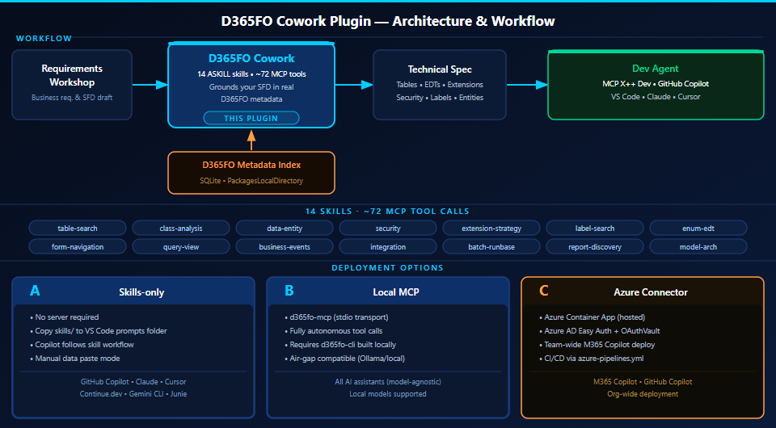

# D365FO Cowork Plugin

A Microsoft 365 Copilot Cowork plugin that brings Dynamics 365 Finance & Operations metadata
search into Microsoft 365 Copilot, VS Code Copilot agent mode, and any AI assistant that
supports the Agent Skills open standard (Claude Code, Cursor, Gemini CLI, JetBrains Junie).

## What this plugin does

Bridges the gap between a workshop SFD and a developer-ready technical specification.

After a requirements workshop, paste your business requirements into Cowork. The plugin
adds the technical layer — table names, field EDTs, entity mappings, extension patterns,
security objects, and labels — all grounded in your actual D365FO metadata index.
The enriched spec is then handed directly to the MCP X++ Dev agent or CLI Cloud Agent
for code generation.



**Example questions you can ask:**

- "I need to add a customs clearance reference to purchase orders — where should I store it
  and what EDT should I use?"
- "What data entity should I use to import vendor invoices from an EDI system via DMF?"
- "Which roles have update access to VendTable? Does my new field need its own privilege?"
- "Before I create a label for 'Approval Tier', check if an existing D365FO label covers it."
- "What classes handle PO confirmation? Any CoC extensions I need to coordinate with?"

Answers come from the local D365FO metadata index (SQLite), not from a live AOS connection.
No runtime AOS access is required for the search connector.

See [EXAMPLES.md](EXAMPLES.md) for end-to-end SFD enrichment walkthroughs.

---

## Repository structure

```
d365fo-cowork-plugin/
├── manifest.json                          # M365 App Manifest v1.28 (Cowork package)
├── color.png                              # 192x192 plugin icon (color)
├── outline.png                            # 32x32 plugin icon (outline)
├── Dockerfile                             # .NET 10 multi-stage build for remote MCP connector
├── deploy-azure.ps1                       # Interactive Azure deployment (one-time / local)
├── azure-pipelines.yml                    # Azure DevOps YAML pipeline (CI/CD automation)
├── package.ps1                            # ASKILL validation + ZIP packaging
├── README.md                              # This file
├── EXAMPLES.md                            # Usage examples with sample prompts
└── skills/
    ├── d365fo-table-search/
    │   ├── SKILL.md
    │   └── references/field-types.md
    ├── d365fo-class-analysis/
    │   └── SKILL.md
    ├── d365fo-data-entity-discovery/
    │   └── SKILL.md
    ├── d365fo-security-coverage/
    │   └── SKILL.md
    ├── d365fo-extension-strategy/
    │   ├── SKILL.md
    │   └── references/extension-patterns.md
    └── d365fo-label-search/
        └── SKILL.md
```

---

## Prerequisites

| Requirement | Skills-only | Local MCP | Azure connector |
|---|---|---|---|
| VS Code 1.90+ | Required | Required | Required |
| GitHub Copilot Chat | Required | Required | Required |
| .NET SDK 10 | Not needed | Required | Required (build only) |
| d365fo-cli built | Not needed | Required | Required (index baked into image) |
| D365FO index built | Not needed | Required | Required |
| Azure subscription | Not needed | Not needed | Required |
| M365 Global / Copilot Admin | Not needed | Not needed | Required (one-time) |
| Frontier preview program | Not needed | Not needed | Required |

---

### Installing d365fo-cli

`d365fo-cli` is a .NET 10 project — not an npm package. You build it from source.
Source repository: **https://github.com/AurelienClere-365/d365fo-cli**
(fork of [dynamics365ninja/d365fo-cli](https://github.com/dynamics365ninja/d365fo-cli))

**1. Install .NET SDK 10** (if not already installed):

```powershell
# Check current version
dotnet --version   # must be 10.x

# If not installed: https://dotnet.microsoft.com/download
# Or via winget:
winget install Microsoft.DotNet.SDK.10
```

**2. Clone and build the CLI:**

```powershell
git clone https://github.com/AurelienClere-365/d365fo-cli.git C:\tools\d365fo-cli
cd C:\tools\d365fo-cli
dotnet build d365fo-cli.slnx -c Release
```

**3. Add a PowerShell function alias** (add to your `$PROFILE`):

```powershell
function d365fo { dotnet run --project C:\tools\d365fo-cli\src\D365FO.Cli -- @args }
function d365fo-mcp { dotnet run --project C:\tools\d365fo-cli\src\D365FO.Mcp -- @args }
```

Or publish a self-contained binary for faster startup:

```powershell
dotnet publish C:\tools\d365fo-cli\src\D365FO.Cli -c Release -r win-x64 --self-contained `
  -o C:\tools\d365fo-cli\bin
# Add C:\tools\d365fo-cli\bin to your PATH
```

---

### Building the D365FO metadata index

The index is a local SQLite snapshot of your D365FO `PackagesLocalDirectory`.
It is the data source for all Cowork plugin skills.

**1. Locate your `PackagesLocalDirectory` for your environment type:**

| Environment type | Typical `PackagesLocalDirectory` path | How to run the CLI |
|---|---|---|
| **Cloud Hosted Environment (CHE)** | `K:\AosService\PackagesLocalDirectory` | RDP into the dev VM, run CLI there |
| **Local VHD (Tier 1 one-box)** | `C:\AOSService\PackagesLocalDirectory` | Run CLI on the VM directly |
| **On-premises AOS** | `<AosInstall>\PackagesLocalDirectory` | Run CLI on any machine with the folder mounted |
| **Tier 2+ sandbox** | No direct filesystem access | See note below |
| **LCS deployable package** | Extracted archive sub-folder | See note below |

> **Tier 2+ sandbox (Microsoft-hosted):** These environments do not expose the filesystem.
> The recommended approach is to build the index from a **CHE or one-box environment that
> has the same code baseline and customizations deployed** — the index only needs the
> metadata XML files, not a running AOS.
>
> If you only have access to a sandbox, you can export a **deployable package** from LCS
> (Asset Library > Software deployable package) and extract the archive. The package
> contains the `PackagesLocalDirectory` folder structure with the metadata XML files.
> Point `D365FO_PACKAGES_PATH` at the extracted folder and run `d365fo index build` on
> any Windows machine:
>
> ```powershell
> Expand-Archive "\path\to\deployable-package.zip" "C:\d365fo-meta"
> $env:D365FO_PACKAGES_PATH = "C:\d365fo-meta\PackagesLocalDirectory"
> d365fo index build
> d365fo index extract
> ```

**2. Set the environment variable:**

```powershell
# Set permanently in your profile — replace with your actual path
$env:D365FO_PACKAGES_PATH = "K:\AosService\PackagesLocalDirectory"
[System.Environment]::SetEnvironmentVariable(
    "D365FO_PACKAGES_PATH",
    "K:\AosService\PackagesLocalDirectory",
    "User"
)
```

**3. Build and extract the index:**

```powershell
d365fo index build     # scans PackagesLocalDirectory and builds the SQLite index
d365fo index extract   # populates all object tables (tables, classes, labels, etc.)
```

This takes 2–15 minutes depending on the number of models. Run once per environment;
refresh after deploying new ISV solutions:

```powershell
d365fo index refresh --model MyCustomModel   # incremental refresh for one model
```

**4. Verify the index is ready:**

```powershell
d365fo doctor --output json
d365fo index status --output json
```

**5. Test a search:**

```powershell
d365fo search table Cust --output json
d365fo get table CustTable --output json
d365fo find coc SalesTable::insert --output json
```

The index file is stored at:
```
%LOCALAPPDATA%\d365fo-cli\d365fo-index.sqlite
```

This is the file that gets baked into the Docker image for the Azure connector.

---

### Configuring the MCP server (local — Option B)

```powershell
# Start the MCP server in stdio transport (VS Code reads it)
d365fo-mcp   # or: d365fo mcp --transport stdio

# Start in HTTP transport (for testing with curl)
d365fo-mcp --transport streamable-http --port 8080
```

VS Code `mcp.json` configuration:

```json
{
  "servers": {
    "d365fo": {
      "type": "stdio",
      "command": "d365fo-mcp",
      "env": {
        "D365FO_PACKAGES_PATH": "K:\\AosService\\PackagesLocalDirectory"
      }
    }
  }
}
```

---

## Option A: Skills-only (VS Code Copilot agent mode — no server needed)

Skills act as structured prompt guidance. Copilot follows the skill workflow but asks you to
paste raw data manually (no automatic tool calls).

**1. Copy skills to the VS Code prompts folder:**

```powershell
$dest = "$env:APPDATA\Code\User\prompts"
New-Item -ItemType Directory -Force $dest | Out-Null
Copy-Item -Recurse ".\skills\*" $dest
```

**2. Restart VS Code, open Copilot Chat (`Ctrl+Shift+I`), switch to Agent mode.**

**3. Test:** Type `What fields does SalesTable have?` — Copilot will follow the
`d365fo-table-search` skill workflow.

> In skills-only mode the agent cannot call MCP tools automatically. It will ask you to run
> `d365fo-cli get-table-info SalesTable` and paste the output.

---

## Option B: Skills + Local MCP (VS Code — full auto mode)

Requires D365FO CLI MCP server running locally. Copilot calls tools autonomously.

**1. Create or edit `.vscode/mcp.json` in your workspace** (or user-level `mcp.json`):**

```json
{
  "servers": {
    "d365fo": {
      "type": "stdio",
      "command": "d365fo-mcp",
      "env": {
        "D365FO_PACKAGES_PATH": "K:\\AosService\\PackagesLocalDirectory"
      }
    }
  }
}
```

If you used the self-contained publish approach, replace `"d365fo-mcp"` with the full path
to the published binary (e.g. `"C:\\tools\\d365fo-cli\\bin\\d365fo-mcp.exe"`).

**2. Copy skills as in Option A.**

**3. In Copilot agent mode**, the agent now calls `search_tables`, `get_class_info`, etc.
automatically — no manual data pasting needed.

---

## Using with other AI assistants and custom models

The skills and MCP server are model-agnostic and work with any AI assistant that
supports SKILL.md files or MCP tool calls — not just Microsoft 365 Copilot.

### GitHub Copilot — switching the underlying model

In VS Code Copilot Chat, click the **model picker** in the chat input bar to switch between:

| Model | Provider | Notes |
|---|---| ---|
| GPT-4o | OpenAI | Default |
| o3 / o4-mini | OpenAI | Reasoning models — good for complex extension strategy questions |
| Claude Sonnet / Claude Opus | Anthropic | Strong at long-context SFD enrichment |
| Gemini 2.5 Pro | Google | Available via Copilot enterprise |

The MCP server and all skills work identically regardless of which model is active.

---

### Claude Code (Anthropic)

Claude Code reads SKILL.md files from the project context and supports MCP natively.

```bash
# Register the local MCP server once
claude mcp add d365fo d365fo-mcp

# Skills: add the skills folder as project context, then ask normally
cd your-project
claude
> What fields does SalesTable have?
```

For the remote Azure connector, register via SSE:

```bash
claude mcp add d365fo-remote \
  --transport sse \
  https://d365fo-mcp.kindsky-xxx.westeurope.azurecontainerapps.io/mcp
```

---

### Cursor

Add the MCP server to `.cursor/mcp.json` in the repo root:

```json
{
  "mcpServers": {
    "d365fo": {
      "command": "d365fo-mcp",
      "env": {
        "D365FO_PACKAGES_PATH": "K:\\AosService\\PackagesLocalDirectory"
      }
    }
  }
}
```

Skills placed in the workspace are automatically loaded as context by Cursor agent mode.
You can also switch to `claude-4-opus`, `gpt-4.5`, or any model Cursor exposes in its
model picker — the MCP tools work with all of them.

---

### Continue.dev + Ollama (fully local — no data leaves the machine)

```json
// .continue/config.json
{
  "models": [{
    "title": "Llama 3.3 70B (local)",
    "provider": "ollama",
    "model": "llama3.3:70b"
  }],
  "mcpServers": [{
    "name": "d365fo",
    "command": "d365fo-mcp",
    "env": { "D365FO_PACKAGES_PATH": "K:\\AosService\\PackagesLocalDirectory" }
  }]
}
```

The index and all metadata remain local. Suitable for air-gapped or strict data-residency
environments.

---

### Gemini CLI

```bash
# Pass skills as context files
gemini --context skills/d365fo-table-search/SKILL.md \
       --context skills/d365fo-extension-strategy/SKILL.md \
       "What extension point should I use to add a field to SalesTable?"
```

To use all skills at once, reference each SKILL.md explicitly or use a wrapper script
that concatenates them.

---

### JetBrains Junie

Place the `skills/` folder in the project root. Junie loads SKILL.md files from the
project context automatically. MCP tool registration follows the JetBrains MCP server
configuration (`.junie/mcp.json`).

---

## Option C: Full Cowork plugin with Azure connector (shared team access)

Deploy the D365FO CLI MCP server as an Azure Container App and install the plugin in
Microsoft 365 Copilot for your whole team.

### Step 1: Copy the metadata index into the repo root

```powershell
Copy-Item "$env:LOCALAPPDATA\d365fo-cli\d365fo-index.sqlite" .\d365fo-index.sqlite
```

### Step 2: Deploy to Azure

> **Region tip:** `westeurope` is sometimes at AKS capacity. If step 4 fails with
> `AKSCapacityHeavyUsage`, retry with `-Location northeurope` or `-Location francecentral`.

```powershell
.\deploy-azure.ps1 `
  -ResourceGroup  "rg-d365fo-tools" `
  -Location       "northeurope" `
  -AcrName        "acrd365fotools" `
  -AppName        "d365fo-mcp" `
  -EnvironmentName "cae-d365fo-tools"
```

The script runs 7 deployment steps then automatically executes **4 smoke tests**:

| Test | What is validated |
|---|---|
| Health endpoint | `GET /health` returns 200 — container is up |
| Auth gate | Unauthenticated `POST /mcp` returns 401 — Easy Auth is working |
| MCP initialize | Authenticated `initialize` call succeeds — MCP server is functional |
| MCP tools/list | At least one tool advertised — D365FO index loaded correctly |

At the end the script prints:
```
MCP Server URL  : https://d365fo-mcp.xxx.northeurope.azurecontainerapps.io/mcp
Client ID       : xxxxxxxx-xxxx-xxxx-xxxx-xxxxxxxxxxxx
Client Secret   : <value>  <-- STORE SECURELY
```

#### If a deployment fails mid-way — clean retry

Use `-Cleanup` to delete all Azure resources (ACR, Container App, Environment) and start
fresh. The Azure AD app registration is preserved so the Client ID stays stable.

> **Note:** ACR name deletion propagates globally — wait ~3 minutes after `-Cleanup`
> before redeploying to avoid "name still reserved" errors.

```powershell
# 1. Delete everything
.\deploy-azure.ps1 -ResourceGroup "rg-d365fo-tools" -Location "northeurope" `
  -AcrName "acrd365fotools" -AppName "d365fo-mcp" -EnvironmentName "cae-d365fo-tools" `
  -Cleanup

# 2. Redeploy cleanly
.\deploy-azure.ps1 -ResourceGroup "rg-d365fo-tools" -Location "northeurope" `
  -AcrName "acrd365fotools" -AppName "d365fo-mcp" -EnvironmentName "cae-d365fo-tools"
```

#### Re-run smoke tests only — no redeploy

Use `-TestOnly` to run the 4 smoke tests against the already-deployed app without
rebuilding the image or touching any Azure resources. Useful after fixing Easy Auth
or updating OAuth registration.

```powershell
.\deploy-azure.ps1 `
  -ResourceGroup "rg-d365fo-tools" -Location "northeurope" `
  -AcrName "acrd365fotools" -AppName "d365fo-mcp" -EnvironmentName "cae-d365fo-tools" `
  -TestOnly `
  -ClientId     "<Application (client) ID>" `
  -ClientSecret "<client secret from deployment output>"
```

The `-ClientId` and `-ClientSecret` values are printed at the end of every full
deployment run under **SECURE endpoint**.

### Step 3: Update manifest.json

Open `manifest.json` and replace the `mcpServerUrl` placeholder. The connector block
should look like this after your deployment:

```json
"agentConnectors": [{
  "id": "d365fo-cli-connector",
  "displayName": "D365FO CLI MCP",
  "description": "Remote MCP connector to the D365FO CLI metadata search server hosted on Azure Container Apps.",
  "toolSource": {
    "remoteMcpServer": {
      "mcpServerUrl": "https://d365fo-mcp.kindsky-xxx.westeurope.azurecontainerapps.io/mcp",
      "mcpToolDescription": { "file": "d365fo-mcp-tools.json" },
      "authorization": {
        "type": "OAuthPluginVault",
        "referenceId": "REPLACE_WITH_VAULT_REFERENCE_ID"
      }
    }
  }
}]
```

### Step 4: Package

```powershell
.\package.ps1
```

This validates all skills (rules P001-P008) and creates `d365fo-cowork-plugin.zip`.

### Step 5: Install in Cowork

> **Note:** Cowork is a Microsoft 365 Frontier preview. Enroll at
> https://adoption.microsoft.com/copilot/frontier-program before installing.
> The Frontier toggle must also be ON in M365 Admin Center → **Copilot** → **Settings** → **Frontier**.

**Sideload (personal test):**
1. Go to [admin.microsoft.com](https://admin.microsoft.com) → **Agents** → **All agents**
2. Click the **`...`** menu (top-right of the agent list) → **Add agent**
3. Upload `d365fo-cowork-plugin.zip`
4. Open Microsoft 365 Copilot — the plugin appears in the **Sources & Skills** panel (toggle it on)

**Org-wide deploy:**
1. Go to [admin.microsoft.com](https://admin.microsoft.com) → **Agents** → **All agents**
2. Click the **`...`** menu → **Add agent** → upload `d365fo-cowork-plugin.zip`
3. Once added, find **D365FO Cowork** in the list, open it, and under **Deploy to** select
   **Entire organisation** or **Specific users/groups** → click **Deploy**
4. The plugin appears automatically in users' Sources & Skills panel

**Updating an existing deployment:**

> **Important — avoid the skill count error:** If D365FO Cowork was previously installed
> via the Cowork UI (Browse plugins), it exists as a personal sideload and will **not**
> appear in All agents. Trying to "Add agent" again creates a second copy and triggers
> *"Total agent skills count exceeds the maximum allowed (20)"*.
>
> **Correct update flow:**
> 1. Open **Microsoft Teams** → left sidebar **Apps** → **Manage your apps**
> 2. Find **D365FO Cowork** → `...` → **Remove** (removes the personal sideload)
> 3. Go to [admin.microsoft.com](https://admin.microsoft.com) → **Agents** → **All agents**
> 4. Click `...` → **Add agent** → upload the new ZIP
> 5. Open the agent → **Deploy to** → **Entire organisation** (or specific groups)

If D365FO Cowork already appears in All agents as an org-managed app:
1. Find **D365FO Cowork** → `...` → **Update** → upload the new ZIP

### Step 6: Configure OAuthPluginVault (required for MCP tools to work)

> **Important:** Without OAuthPluginVault, Cowork cannot inject a Bearer token into
> calls to your Container App. Easy Auth will reject every request with HTTP 401 and
> the MCP tools will not fire. Complete this step after Step 2 (Azure deployment).

#### 6a — Get the values from deploy-azure.ps1 output

`deploy-azure.ps1` prints everything you need at the end of its run:

```
Client ID     : xxxxxxxx-xxxx-xxxx-xxxx-xxxxxxxxxxxx
Client Secret : <secret value>   ← copy immediately, shown once
Tenant ID     : xxxxxxxx-xxxx-xxxx-xxxx-xxxxxxxxxxxx
MCP Server URL: https://d365fo-mcp.kindsky-xxx.westeurope.azurecontainerapps.io/mcp
Scope         : api://d365fo-mcp-server/.default
```

Store the client secret in Azure Key Vault immediately after copying — it is never
written to any file in this repo.

#### 6b — Register in Teams Developer Portal

1. Go to [dev.teams.microsoft.com](https://dev.teams.microsoft.com) → **Tools** →
   **OAuth client registration** → **Register**
2. Fill in the form:

| Field | Value |
|---|---|
| Registration name | `D365FO Cowork` |
| Base URL | MCP Server URL from deploy-azure.ps1 output (e.g. `https://d365fo-mcp.xxx.azurecontainerapps.io`) |
| Restrict usage by organization | **My organization only** |
| Restrict usage by Teams app | **Existing Teams app** |
| Teams app ID | your manifest `id` value |
| Client ID | from deploy-azure.ps1 output |
| Client secret | from deploy-azure.ps1 output |
| Authorization endpoint | `https://login.microsoftonline.com/{tenantId}/oauth2/v2.0/authorize` |
| Token endpoint | `https://login.microsoftonline.com/{tenantId}/oauth2/v2.0/token` |
| Refresh endpoint | `https://login.microsoftonline.com/{tenantId}/oauth2/v2.0/token` |

   Replace `{tenantId}` with the Tenant ID from deploy-azure.ps1 output.

3. Click **Save** — copy the **OAuth registration ID** shown. That is your `referenceId`.

#### 6c — Update manifest.json and redeploy

```json
"authorization": {
  "type": "OAuthPluginVault",
  "referenceId": "YOUR_OAUTH_REGISTRATION_ID"  // OAuth registration ID from step 6b
}
```

Also replace `mcpServerUrl` with the real URL from deploy-azure.ps1:

```json
"mcpServerUrl": "https://d365fo-mcp.kindsky-xxx.westeurope.azurecontainerapps.io/mcp"
```

Then bump `"version"` in `manifest.json`, run `.\package.ps1`, and update the plugin
following the flow in **Step 5 — Updating an existing deployment** above.

After updating, Cowork will prompt each user to consent once; tokens are then stored and
re-injected automatically on every call to the Container App.

---

## Updating the metadata index

The SQLite index is a snapshot of your D365FO environment. Rebuild when you add new ISV
solutions or deploy customizations:

```powershell
# Rebuild
d365fo-cli index build --metadata "K:\AosService\PackagesLocalDirectory"

# If using Option C, redeploy the container with the updated index
Copy-Item "$env:LOCALAPPDATA\d365fo-cli\d365fo-index.sqlite" .\d365fo-index.sqlite
.\deploy-azure.ps1 -ResourceGroup "rg-d365fo-tools" -Location "northeurope" `
                   -AcrName "acrd365fotools" -AppName "d365fo-mcp" `
                   -EnvironmentName "cae-d365fo-tools"
```

---

## Security (Azure connector only)

Without authentication the Container App URL is publicly reachable — anyone who finds it
can query your D365FO metadata index. `deploy-azure.ps1` applies two layers of protection
automatically.

### Layer 1 — Azure AD Easy Auth (tenant lock)

Easy Auth is enabled on the Container App at the ingress level.
Every HTTP request must carry a Bearer token issued by your Azure AD tenant for the
specific audience `api://<appName>-server`. Requests without a valid token are rejected
with **HTTP 401 before they reach the MCP server process**.

```
Cowork (M365 cloud)
  │  GET /mcp  +  Authorization: Bearer <token>
  ▼
Azure Container Apps ingress
  │  validates JWT signature, iss, aud, tenant claim
  │  rejects → HTTP 401  if any claim fails
  ▼
D365FO CLI MCP server (only sees authenticated requests)
```

What this prevents:
- External callers who don't have credentials in your Azure AD tenant
- Token replay from other Azure AD tenants (multi-tenant tokens rejected)
- Any request without a token (curl, browser, scanners)

### Layer 2 — OAuthPluginVault (Cowork token injection)

In `manifest.json`, the `agentConnectors` entry includes an `authorization.referenceId`.
This tells Cowork to automatically obtain a Bearer token using the client credentials
you registered in M365 Copilot admin, and attach it to every call to the MCP server.

```json
"authorization": {
  "type": "OAuthPluginVault",
  "referenceId": "REPLACE_WITH_VAULT_REFERENCE_ID"
}
```

### Registering the OAuth credential in M365 Copilot Admin

See **Step 6b** above for the full procedure. `deploy-azure.ps1` prints all the values
you need. Quick reference:

1. Go to [admin.microsoft.com](https://admin.microsoft.com) → **Settings** → **Copilot** → **Plugin management**
2. Click **Add OAuth credential** and enter the values printed by `deploy-azure.ps1`:

| Field | Value (from deploy-azure.ps1 output) |
|---|---|
| Client ID | printed as `Client ID` |
| Client secret | printed as `Client Secret` (store in Key Vault after) |
| Token URL | `https://login.microsoftonline.com/<tenantId>/oauth2/v2.0/token` |
| Scope | `api://<appName>-server/.default` |

3. Save — copy the **Vault reference ID** shown.
4. Paste the vault ID into `manifest.json` at `authorization.referenceId`.
5. Run `.\package.ps1` and re-upload the ZIP.

### What is NOT protected

| Risk | Status |
|---|---|
| Unauthenticated external calls | Blocked by Easy Auth |
| Calls from other Azure AD tenants | Blocked (audience + issuer check) |
| Calls from users in your tenant (not just Cowork) | Allowed — any valid service principal in your tenant can call it. Acceptable for internal tools; add role assignment if stricter control needed. |
| The SQLite index file itself | Protected inside container image in ACR (private registry). Not accessible externally. |
| Client secret leaking from source control | Only printed to console — never written to files in this repo. Store in Key Vault. |

### Rotating the client secret

```powershell
# Generate a new secret and update the M365 admin registration
az ad app credential reset --id <clientId> --years 2
# Then update the vault credential in M365 admin center with the new secret.
```

---

## ASKILL validation rules (package.ps1)

| Rule | Description |
|---|---|
| P001 | Each `agentSkills` folder path exists on disk |
| P002 | Each folder contains a `SKILL.md` file |
| P003 | `SKILL.md` has valid YAML frontmatter (`---` delimiters) |
| P004 | Frontmatter has a `name` field |
| P005 | Frontmatter has a `description` field |
| P006 | `name` value matches the folder name (case-sensitive) |
| P007 | `name` is valid kebab-case (lowercase, hyphens only) |
| P008 | No duplicate folder entries in `agentSkills` |

---

## Adding a new skill

1. Create `skills/your-skill-name/SKILL.md` — `name` in frontmatter must equal `your-skill-name` exactly.
2. Add `{ "folder": "./skills/your-skill-name" }` to the `agentSkills` array in `manifest.json`.
3. Run `.\package.ps1` — validates and repackages automatically.
4. Test in VS Code agent mode before distributing.

---

## CI/CD automation with Azure DevOps

`azure-pipelines.yml` automates the full build + deploy lifecycle.
Commit to `main` → pipeline triggers automatically.

### One-time setup

**1. Create an Azure Resource Manager service connection** in your ADO project:
> Project Settings > Service Connections > New > Azure Resource Manager  
> Name it exactly: `sc-azure-d365fo-tools`

**2. Create a variable group** named `d365fo-cowork-secrets`:
> Pipelines > Library > Variable groups > Add group  
> Add these variables (mark as **Secret**):

| Variable | Description |
|---|---|
| `AZURE_TENANT_ID` | Your Azure tenant GUID |
| `AZURE_CLIENT_SECRET` | Client secret from Stage 3 output — paste after first run |
| `D365FO_PACKAGES_PATH` | Path to PackagesLocalDirectory on the build agent |

**3. Import this repo into your ADO project**, then:
> Pipelines > New Pipeline > Azure Repos Git > select repo > Existing YAML > `azure-pipelines.yml`

### Pipeline stages

| Stage | Agent | What it does |
|---|---|---|
| **1 — BuildIndex** | `windows-latest` (or self-hosted with D365FO) | Clones `d365fo-cli` fork, builds it, runs `d365fo index build` + `d365fo index extract`, publishes `d365fo-index.sqlite` as pipeline artifact |
| **2 — BuildAndPushImage** | `ubuntu-latest` | Downloads the index artifact, copies to repo root, runs `az acr build` — no local Docker needed |
| **3 — RegisterAzureAD** | `ubuntu-latest` | Creates the Azure AD app registration and service principal (idempotent) |
| **4 — DeployContainerApp** | `ubuntu-latest` | Creates or updates the Container App with the new image |
| **5 — EnableEasyAuth** | `ubuntu-latest` | Wires Azure AD Easy Auth (`Return401`), prints the final MCP URL and remaining M365 admin steps |

### Agents without PackagesLocalDirectory access

If your ADO build agents do not have access to a D365FO metadata folder, upload the
pre-built index as a **Secure File**:

```
Pipelines > Library > Secure Files > + Secure file > upload d365fo-index.sqlite
```

Then comment out `Stage 1 — BuildIndex` and uncomment the `ProvideIndex` stage block
at the bottom of `azure-pipelines.yml`.

### Updating the index after a new ISV or custom model

```powershell
# On any workstation with PackagesLocalDirectory access:
d365fo index refresh --model MyCustomModel
# Then re-trigger the pipeline (stages 2-5 only via partial run)
```

---

## Contributors

| | Name | LinkedIn |
|---|---|---|
|  | **Aurelien Clere** | [](https://www.linkedin.com/in/aurelien-clere/) |
|  | **Laze Janev** | [](https://www.linkedin.com/in/lazejanev/) |

---

## License

MIT
